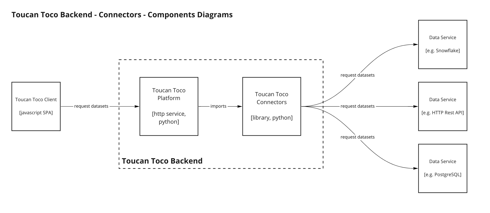

[](https://pypi.python.org/pypi/toucan-connectors)
[](https://pypi.python.org/pypi/toucan-connectors)
[](https://pypi.python.org/pypi/toucan-connectors)
[](https://pypi.python.org/pypi/toucan-connectors)
[](https://github.com/ToucanToco/toucan-connectors/actions?query=workflow%3ACI)
[](https://sonarcloud.io/dashboard?id=ToucanToco_toucan-connectors)

# Toucan Connectors
[Toucan Toco](https://toucantoco.com/fr/) data connectors are plugins to the Toucan Toco platform. Their role is to return [Pandas DataFrames](https://pandas.pydata.org/pandas-docs/stable/reference/api/pandas.DataFrame.html) from many different sources.



Each connector is dedicated to a single type of source (PostrgeSQL, Mongo, Salesforce, etc...) and is made of two classes:

- `Connector` which contains all the necessary information to *use a data provider* (e.g. hostname,  auth method and details, etc...).
- `DataSource` which contains all the information to *get a dataframe* (query, path, etc...) using the `Connector` class above.

The Toucan Toco platform instantiates these classes using values provided by Toucan admin and app designers, it then uses the following methods to get data and metadata:

- `Connector._retrieve_data` returning an instance of `pandas.DataFrame`, method used to return data to a Toucan Toco end user
- `Connector.get_slice` returning an instance of `DataSlice`, method used to return data to a Toucan Toco application designer when building a query.
- `Connector.get_status` returning an instance of `ConnectorStatus`, method used to inform an admin or Toucan Toco application designer of the status of its connection to a third party data service. Is it reachable from our servers? Are the authentication details and method working? etc...

## Installing for development

We use `poetry` for packaging and development. Use the following command to install the project for development:

```
poetry install -E all
```

## Dependencies

This project uses `make` and `Python 3.8`. Install the main dependencies :

```bash
pip install -e .
```

We are using the `setuptools` construct `extra_requires` to define each connector's dependencies separately. For example to install the MySQL connector dependencies:

```bash
pip install -e ".[mysql]"
```

There is a shortcut called `all` to install all the dependencies for all the connectors. I do not recommend that you use this as a contributor to this package, but if you do, use the section below to install the necessary system packages.

```bash
pip install -e ".[all]"
```

You may face issues when instally the repo locally due to dependencies.
That's why a dev container is available to be used with visual studio.
Refer to [this doc](https://code.visualstudio.com/docs/remote/containers) to use it.


### System packages

Some connectors dependencies require specific system packages. As each connector can define its dependencies separatly you do not need this until you want to use these specific connectors.

#### ODBC

On `linux`, you're going to need bindings for `unixodbc` to install `pyodbc` from the requirements, and to install that (using apt), just follow:

```bash
sudo apt-get update
sudo apt-get install unixodbc-dev
```

#### MSSSQL

To test and use `mssql` (and `azure_mssql`) you need to install the Microsoft ODBC driver for SQL Server for
[Linux](https://docs.microsoft.com/en-us/sql/connect/odbc/linux-mac/installing-the-microsoft-odbc-driver-for-sql-server?view=sql-server-ver15)
or [MacOS](https://docs.microsoft.com/en-us/sql/connect/odbc/linux-mac/install-microsoft-odbc-driver-sql-server-macos?view=sql-server-ver15)

#### PostgreSQL

On macOS, to test the `postgres` connector, you need to install `postgresql` by running for instance `brew install postgres`.
You can then install the library with `env LDFLAGS='-L/usr/local/lib -L/usr/local/opt/openssl/lib -L/usr/local/opt/readline/lib' pip install psycopg2`

## Testing

We are using `pytest` and various packages of its ecosystem.
To install the testing dependencies, run:

```bash
pip install -r requirements-testing.txt
```

As each connector is an independant plugin, its tests are written independently from the rest of the codebase.
Run the tests for a specifc connector (`http_api` in this example) like this:

```bash
pytest tests/http_api
```

Note: running the tests above implies that you have installed the specific dependencies of the `http_api` connector (using the `pip install -e .[http_api]` command)

Our CI does run all the tests for all the connectors, like this:

```
pip install -e ".[all]"
make test
```

Some connectors are tested using mocks (cf. `trello`), others are tested by making calls to data providers (cf. `elasticsearch`) running on the system in docker containers. The required images are in the `tests/docker-compose.yml` file, they need to be pulled (cf. `pytest --pull`) to run the relevant tests.

## Contributing

This is an open source repository under the [BSD 3-Clause Licence](https://github.com/ToucanToco/toucan-connectors/blob/master/LICENSE). The Toucan Toco tech team are the maintainers of this repository, we welcome contributions.

At the moment the main use of this code is its integration into Toucan Toco commercially licenced software, as a result our dev and maintenance efforts applied here are mostly driven by Toucan Toco internal priorities.

The starting point of a contribution should be an [Issue](https://github.com/ToucanToco/toucan-connectors/issues), either one you create or an existing one. This allows us (maintainers) to discuss the contribution before it is produced and avoids back and forth in reviews or stalled pull requests.

### Step 1: Generate base classes and tests files

To generate the connector and test modules from boilerplate, run:

```
make new_connector type=mytype
```

`mytype` should be the name of a system we would like to build a connector for,
such as `MySQL` or `Magento`.

Open the folder in `tests` for the new connector. You can start writing your tests before implementing it.

Some connectors are tested with calls to the actual data systems that they target,
for example `elasticsearch`, `mongo`, `mssql`.

Others are tested with mocks of the
classes or functions returning data that you are wrapping (see : `HttpAPI`, or
`microstrategy`).

If you have a container for your target system, add a docker image in
the `docker-compose.yml`, then use the `pytest` fixture `service_container` to automatically
start the docker and shut it down for you when you are running tests.

The fixture will not pull the image for you for each test runs, you need to pull the image on your machine (at least once) using the `pytest --pull` option.

### Step 2: New connector

Open the folder `mytype` in `toucan_connectors` for your new connector and create your classes.

```python
import pandas as pd

# Careful here you need to import ToucanConnector from the deep path, not the __init__ path.
from toucan_connectors.toucan_connector import ToucanConnector, ToucanDataSource


class MyTypeDataSource(ToucanDataSource):
    """Model of my datasource"""
    query: str


class MyTypeConnector(ToucanConnector):
    """Model of my connector"""
    data_source_model: MyTypeDataSource

    host: str
    port: int
    database: str

    def _retrieve_data(self, data_source: MyTypeDataSource) -> pd.DataFrame:
        ...

    def get_slice(self, ...) -> DataSlice:
        ...

    def get_status(self) -> ConnectorStatus:
        ...
```

### Step 3: Register your connector, add documentation

Add your connector in `toucan_connectors/__init__.py`.
The key is what we call the `type` of the connector, which
is an id used to retrieve it when used in Toucan Toco platform.

```python
CONNECTORS_CATALOGUE = {
  ...,
  'MyType': 'mytype.mytype_connector.MyTypeConnector',
  ...
}
```

Add you connector requirements to the `setup.py` in the `extras_require` dictionary:

```ini
extras_require = {
    ...
    'mytype': ['my_dependency_pkg1==x.x.x', 'my_dependency_pkg2>=x.x.x']
}
```

If you need to add testing dependencies, add them to the `requirements-testing.txt` file.

You can now generate and edit the documentation page for your connector:

```shell
# Example: PYTHONPATH=. python doc/generate.py github > doc/connectors/github.md
PYTHONPATH=. python doc/generate.py myconnectormodule > doc/connectors/mytypeconnector.md
```

### Step 4 : Create a pull request

Make sure your new code is properly formatted by running `make lint`. If it's not, please use `make format`. You can now create a pull request.

## Publishing a release

1. Create a pull request updating **only** the [changelog](CHANGELOG.md) and the `version`
   attribute of the `[tool.poetry]` section in the `pyproject.toml` file.

2. Once the pull request is approved, merge it using the **squash and merge** strategy.

3. Create an annotated tag for the release commit. it should be in the `vX.Y.Z` format, where `X.Y.Z` is the semver
   version defined in `pyproject.toml`. Example:
   ```
   git tag -a v1.23.45 -m v1.23.45 ea3768a
   git push origin v1.23.45
   ```

4. In the project's *Releases* page, click on the *Draft a new release* button. Pick the tag you just pushed,
   and click on *Generate release notes*. Adapt the releases notes if needed, and click on *Publish release*.

5. A GitHub action in charge of publishing the required artifacts to PyPI should now be running. Make sure
   the action is successful.
